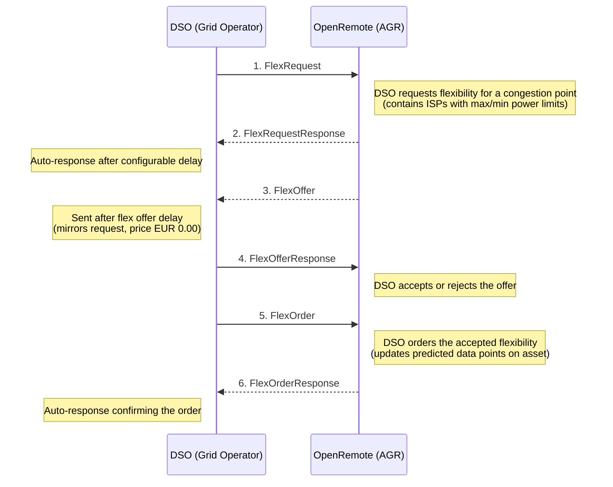

# Energy Management System (EMS)

## GOPACS Integration

### What is GOPACS?

[GOPACS](https://www.gopacs.eu/) (Grid Operators Platform for Congestion Solutions) is a platform operated by Dutch grid operators (DSOs and TSO) to resolve grid congestion through flexibility trading. When the electricity grid is at risk of overloading, GOPACS sends flexibility requests to market participants (aggregators) who can adjust their energy consumption or production to relieve congestion.

The communication between GOPACS and market participants uses the **UFTP** (Universal Flexibility Trading Protocol), part of the [USEF](https://www.usef.energy/) framework, implemented via the [Shapeshifter](https://github.com/shapeshifter/shapeshifter-library-java) library.

For detailed documentation, see: [GOPACS documents and manuals](https://www.gopacs.eu/en/documents-and-manuals/)

### Getting Started

To participate in GOPACS flex trading through OpenRemote, you need:

1. **A GOPACS account** — Register as a Trading Company at [gopacs.eu](https://www.gopacs.eu/)
2. **OAuth2 client credentials** (`client_id` and `client_secret`) — See [OAuth2 Client Credentials for API Clients](https://www.gopacs.eu/wp-content/uploads/2025/12/GOPACS-OAuth2-Client-credentials-for-API-Clients-03-12-2025.pdf)
3. **A signing key pair** — An Ed25519 private key file for signing UFTP messages. The corresponding public key must be registered with GOPACS
4. **A contracted EAN** — The EAN (European Article Number) identifying your grid connection point, as agreed with your DSO

#### Configuration

The following environment variables must be set on the OpenRemote manager:

| Variable | Required | Description |
|---|---|---|
| `GOPACS_PRIVATE_KEY_FILE` | Yes | File path to the Ed25519 private key for signing UFTP messages |
| `GOPACS_CLIENT_ID` | Yes | OAuth2 client ID from GOPACS |
| `GOPACS_CLIENT_SECRET` | Yes | OAuth2 client secret from GOPACS |
| `GOPACS_PARTICIPANT_URL` | No | Address book base URL (default: `https://clc-message-broker.gopacs-services.eu`) |
| `GOPACS_OAUTH2_URL` | No | OAuth2 token endpoint (default: `https://auth.gopacs-services.eu/realms/gopacs/protocol/openid-connect/token`) |
| `GOPACS_RESPONSE_DELAY_SECONDS` | No | Delay before auto-responding to messages (default: `10`) |
| `GOPACS_FLEX_OFFER_DELAY_SECONDS` | No | Delay before sending a flex offer (default: `30`) |

#### Asset Setup

In OpenRemote, create an **EMS GOPACS Asset** as a child of an **EMS Energy Optimisation Asset** and set the `contractedEAN` attribute to your grid connection's EAN.

Alternatively, when creating a new **EMS Energy Optimisation Asset**, you can enable the "Include GOPACS" attribute to have the GOPACS child asset created automatically. Note that this only works during initial asset creation — if the **EMS Energy Optimisation Asset** already exists, you need to manually create the **EMS GOPACS Asset** as a child.

### Developer Guide

#### Components

```
gopacs/
  GOPACSHandler.java              Core orchestrator — handles all UFTP message processing,
                                  signing, OAuth2 auth, and scheduling
  GOPACSServerResource.java       JAX-RS interface for the inbound endpoint (POST /gopacs/message)
  GOPACSServerResourceImpl.java   Delegates incoming XML to GOPACSHandler::processRawMessage
  GOPACSAuthResource.java         RESTEasy client proxy for OAuth2 token requests
  GOPACSAddressBookResource.java  RESTEasy client proxy for DSO participant lookup
  FlexRequestISPTypeHelper.java   Converts ISP numbers to timestamps (with DST handling)
  OAuth2TokenResponse.java        DTO for OAuth2 token responses
```

Related files outside this package:
- `agent/EmsGOPACSAsset.java` — JPA entity defining the GOPACS asset type (contracted EAN, power attributes)
- `manager/EmsOptimisationService.java` — Manages `GOPACSHandler` lifecycle (creates/destroys handlers when assets are added/removed)
- `manager/EmsOptimisationSetupService.java` — Setup class that optionally creates GOPACS assets

#### Data Flow

OpenRemote acts as an **AGR (Aggregator)** in the UFTP protocol. The message exchange with the DSO (Distribution System Operator) follows this flow:



**How flex orders feed into optimisation:**

1. `FlexOrder` power values are written as predicted data points on the `EmsGOPACSAsset` attributes (`powerLimitMaximumProfileFlexOrder`, `powerLimitMinimumProfileFlexOrder`)
2. `EmsOptimisationService.updatePowerLimitProfileTotalForecasts()` merges these GOPACS constraints with manual power limits from the parent `EmsEnergyOptimisationAsset`
3. The combined limits are used by the optimisation methods to constrain energy scheduling

#### Inbound Endpoint

The handler deploys a JAX-RS web application at `/gopacs`. Incoming signed UFTP XML messages are posted to:

```
POST /gopacs/message
Content-Type: application/xml
```

Processing steps:
1. Deserialize signed XML envelope
2. Verify cryptographic signature using the sender's public key (from address book)
3. Deserialize UFTP payload
4. Process business logic (update asset attributes, schedule data points)
5. After a delay, send the auto-response (ensures the HTTP response is returned first)

#### Authentication

- **Inbound messages**: Verified using the DSO's public key, fetched from the GOPACS address book (`GET /v2/participants/DSO?contractedEan=<EAN>`) and cached in memory
- **Outbound messages**: Signed with the private key from `GOPACS_PRIVATE_KEY_FILE`, delivered with an OAuth2 Bearer token obtained via client credentials flow from the GOPACS Keycloak instance

#### ISP Handling

ISPs (Imbalance Settlement Periods) are 15-minute intervals. `FlexRequestISPTypeHelper` converts ISP numbers to timestamps and includes special handling for European DST transitions (CET/CEST) on the last Sundays of March and October.

## Redispatch (Intraday Congestion Management)

### Overview

In addition to the UFTP day-ahead flex trading described above, GOPACS provides a **Redispatch** mechanism for intraday congestion management. When a congestion situation is expected today, grid operators publish announcements requesting flexibility from market participants.

The Redispatch flow is different from the UFTP flow:

1. **Announcements** — GOPACS publishes congestion announcements via a REST API
2. **EAN effectivity** — CSPs check which of their EANs can help solve the congestion
3. **Bidding** — CSPs place buy/sell orders on connected trading platforms (ETPA, EPEX SPOT, NordPool)
4. **Matching** — The GOPACS algorithm matches orders across platforms
5. **Activation** — The trading platform notifies the CSP when an order is filled
6. **Delivery** — The CSP adjusts power as agreed

### Configuration

| Variable | Required | Description |
|---|---|---|
| `GOPACS_REDISPATCH_API_KEY` | Yes | API key from GOPACS UI (User Menu > Settings > Generate API-key); required to resolve EAN effectivity per announcement. Polling will not start without it. |
| `GOPACS_REDISPATCH_URL` | No | Base URL for the Redispatch API (default: `https://idcons.gopacs-services.eu`) |
| `GOPACS_REDISPATCH_POLL_INTERVAL_MINUTES` | No | Polling interval in minutes (default: `5`, minimum: `5`) |

### Asset Setup

On the **EMS GOPACS Asset**, configure:

- **`redispatchEnabled`** — Set to `true` to start polling for announcements

### Operator Workflow (Pilot Phase)

1. When a relevant congestion announcement is detected, the asset attributes are updated with the announcement details
2. The `redispatchBidStatus` is set to `PENDING_CONFIRMATION`
3. The operator reviews the announcement info and suggested bid values
4. The operator sets `redispatchBidPrice` (EUR/MWh) and toggles `redispatchConfirmBid` to `true`
5. The bid is confirmed and logged (trading platform integration is pending)

### Components

```
gopacs/
  GOPACSRedispatchHandler.java      Polls announcements, checks EAN effectivity, manages bid workflow
  GOPACSAnnouncementResource.java   RESTEasy client proxy for /machineannouncements (public, no auth)
  GOPACSEanEffectivityResource.java RESTEasy client proxy for EAN effectivity (API key auth)
  dto/AnnouncementDto.java          DTO for announcement JSON responses
  dto/TimeSpanDto.java              DTO for time span objects
  dto/EanSolvingEffectivityDto.java DTO for EAN effectivity responses
```

### History

Announcement and bid history are stored as time-series data points on `redispatchAnnouncementHistory` and `redispatchBidHistory` attributes, retained for 90 days. These are viewable in the OpenRemote history panel.

### Future

- **Trading platform integration** — When a platform is chosen (ETPA, EPEX SPOT, or NordPool), automated bid placement will be added
- **Automatic bidding** — After the pilot phase, the confirmation step will be optional
- **Bid pricing engine** — Dynamic bid pricing incorporating BRP imbalance costs, rebound costs, and opportunity costs

### Testing

GOPACS provides a dedicated testing environment. See [Testing UFTP API Flex Messages](https://www.gopacs.eu/wp-content/uploads/2025/12/GOPACS-Testing-receiving-and-sending-flex-messages-by-UFTP-testing-functionality-04-12-2025.pdf) for their guide on sending and receiving flex messages via the UFTP testing functionality.

For additional context on the protocol and contract types, see [Flex Trading with CSC and ATR (UFTP Messages)](https://www.gopacs.eu/wp-content/uploads/2026/02/GOPACS-Flex-trading-with-Capacity-Limiting-Contracts-using-UFTP-messages-11-02-2026.pdf).

#### Company Setup for Testing

To configure your Trading Company for testing Capacity Steering Contracts, follow: [Company Settings for CSC Participation](https://www.gopacs.eu/wp-content/uploads/2025/06/GOPACS-Company-settings-for-participating-in-CSC-Capacity-Steering-Contracts.pdf)
